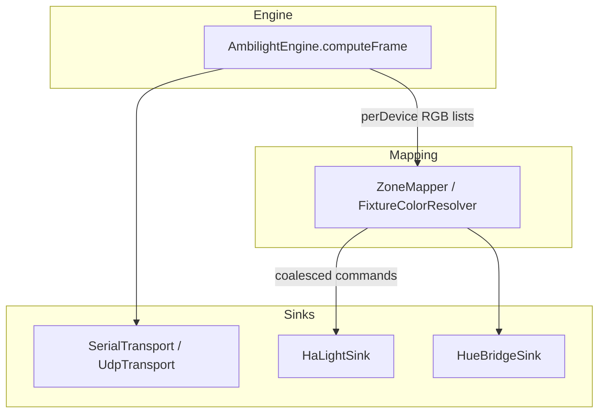
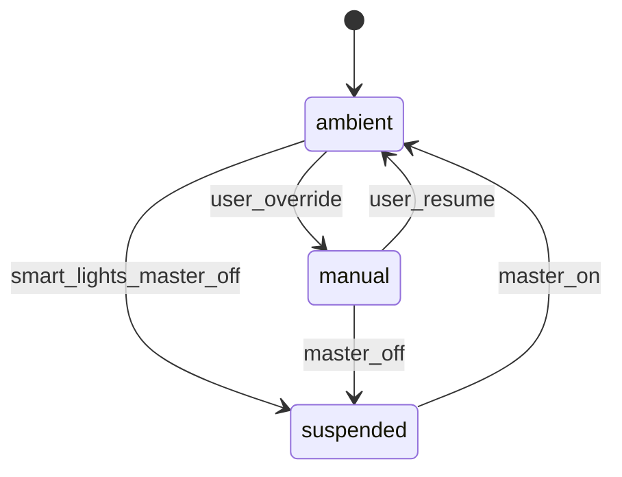
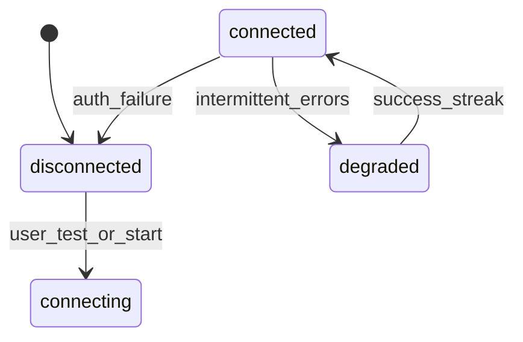

# Plán: Philips Hue + Home Assistant — místnost, ambient a ovládání z aplikace (kompletní)

**Verze dokumentu:** 2 (kompletní rozšíření)  
**Související:** [`AmbiLight-MASTER-PLAN.md`](AmbiLight-MASTER-PLAN.md), kořenový [`README.md`](../README.md)

---

## Obsah

1. [Cíl a rozsah](#1-cíl-a-rozsah)  
2. [Slovník](#2-slovník)  
3. [Stav v repozitáři](#3-stav-v-repozitáři)  
4. [Uživatelské scénáře a akceptační kritéria](#4-uživatelské-scénáře-a-akceptační-kritéria)  
5. [Architektura a komponenty](#5-architektura-a-komponenty)  
6. [Datový model a JSON schéma](#6-datový-model-a-json-schéma)  
7. [Home Assistant — kompletní integrační spec](#7-home-assistant--kompletní-integrační-spec)  
8. [Philips Hue Bridge — kompletní integrační spec](#8-philips-hue-bridge--kompletní-integrační-spec)  
9. [Mapování místnost → barva](#9-mapování-místnost--barva)  
10. [Barvy, jas a kompatibilita světel](#10-barvy-jas-a-kompatibilita-světel)  
11. [Throttling, fronty a výkon](#11-throttling-fronty-a-výkon)  
12. [Stavové automaty](#12-stavové-automaty)  
13. [Chyby, offline režim a degradace](#13-chyby-offline-režim-a-degradace)  
14. [Bezpečnost a compliance](#14-bezpečnost-a-compliance)  
15. [UI — obrazovky a chování](#15-ui--obrazovky-a-chování)  
16. [Integrace do kódu (`AmbilightAppController`)](#16-integrace-do-kódu-ambilightappcontroller)  
17. [Testování a CI](#17-testování-a-ci)  
18. [Fázování s milníky](#18-fázování-s-milníky)  
19. [Mimo rozsah a budoucí rozšíření](#19-mimo-rozsah-a-budoucí-rozšíření)  
20. [Otevřená rozhodnutí (ADR náhrada)](#20-otevřená-rozhodnutí-adr-náhrada)  
21. [Soubory v repu k úpravám](#21-soubory-v-repu-k-úpravám)  

---

## 1. Cíl a rozsah

### 1.1 Cíl

Uživatel v aplikaci:

- **Připojí** Home Assistant (povinně pro fázi 1) a volitelně **Philips Hue Bridge** přímo.
- **Nakonfiguruje místnost**: kde které světlo je vůči TV / monitoru (nebo vůči logickému pásku LED).
- Během provozu aplikace **posílá ambient barvy** na vybrané entity / Hue resources.
- Světla **ovládá z aplikace** (jas, barva, vypnutí) s režimem **Ambient vs ruční override**.
- Při změně v HA (nebo fyzicky) může UI **zobrazit aktuální stav** (po fázi s WebSocket).

### 1.2 Mimo rozsah (explicitně)

| Mimo rozsah MVP | Poznámka |
|------------------|----------|
| Matter / Thread přímá integrace | Později přes HA. |
| Hue **Entertainment API** stream | Fáze 6+, složitý onboarding. |
| Správa scén HA, automatizací, skriptů | Pouze `light` služby a čtení stavu. |
| MQTT přímo z aplikace | Volitelně později; HA REST/WebSocket stačí. |
| iOS/Android klient | Projekt je desktop-only v `ambilight_desktop/`. |

### 1.3 Metriky úspěchu (produkt)

- **Stabilita:** při výpadku HA/Hue ESP výstup **nepadá** a tick **neblokuje** UI déle než X ms (viz §11).
- **Ovladatelnost:** uživatel do 5 minut nastaví 1 entitu + globální ambient (F1).
- **Předvídatelnost:** dokumentované limity latence a rate limitů v UI a README.

---

## 2. Slovník

| Termín | Význam |
|--------|--------|
| **Fixture** | Jedno logické „chytré světlo“ v konfiguraci aplikace (vazba na HA entitu nebo Hue resource). |
| **Ambient režim** | Barva se počítá z engine a odesílá na fixture. |
| **Ruční override** | Uživatel drží barvu/jas; engine pro tuto fixture **neodesílá** barvy (nebo odesílá jen po uvolnění). |
| **Sink** | Výstupní adaptér (HA HTTP, Hue HTTPS, …). |
| **Zone mapper** | Vrstva z `perDevice`/frame na `(fixtureId → RGB)`. |
| **Virtual strip** | Logické zařízení s `ledCount` jen pro výpočet mapování, bez serial/UDP (může nahradit hack s `control_via_ha`). |

---

## 3. Stav v repozitáři

- `DeviceSettings.control_via_ha`: při `true` se v `_distribute` přeskakují serial/UDP — **zástrčka**, ne aktivní HA klient.
- Engine: `AmbilightEngine.computeFrame` → `Map<deviceId, List<(r,g,b)>>`.
- UI: přepínač „Ovládat přes Home Assistant“ v `devices_tab.dart`.

**Strategie migrace:** Zachovat `control_via_ha` pro zpětnou kompatibilitu, ale novou funkcionalitu stavět na **`ambient_fixtures` + HA sink**; v dokumentaci označit `control_via_ha` jako legacy, pokud fixture pokrývá stejný use case.

---

## 4. Uživatelské scénáře a akceptační kritéria

### US1 — Připojení Home Assistant

- **Kroky:** Zadání base URL (`https://home.local:8123`), long-lived tokenu, tlačítko „Test spojení“, uložení.
- **Akceptace:** Při platném tokenu API vrátí 200 na `GET /api/`; při neplatném srozumitelná chyba v UI (401/403).
- **Chování:** Uložená konfigurace přežije restart aplikace.

### US2 — Výběr světel (entit)

- **Kroky:** Po úspěšném testu načíst seznam stavů, filtrovat `entity_id` začínající `light.`, uživatel zaškrtne entity.
- **Akceptace:** Pro každou vybranou entitu lze vytvořit **Fixture** s výchozím názvem z `attributes.friendly_name`.

### US3 — Mapování na obrazovku (screen mode)

- **Kroky:** Pro fixture zvolit vazbu: např. hrana `left|right|top|bottom`, rozsah `t0–t1` (0–1), hloubka v % jako u segmentů, nebo vazba na **indexy virtuálního pásku**.
- **Akceptace:** Při běžícím screen módu se mění barva entity souhlasně s obsahem zóny (vizuální test s plnou barvou okna).

### US4 — Ambient + ruční přepnutí

- **Kroky:** Přepnout fixture na „Ruční“, nastavit barvu, vrátit „Ambient“.
- **Akceptace:** V ručním režimu se po dobu override **nepřepisuje** barva tickem; po návratu na Ambient do max. 2 s následuje engine.

### US5 — Globální vypnutí smart výstupů

- **Kroky:** Master přepínač „Chytrá světla“ OFF.
- **Akceptace:** Žádné HTTP požadavky na HA (kromě případného explicitního „Refresh stavu“); ESP chod dál dle nastavení.

### US6 — (Volitelně F5) Nativní Hue

- **Kroky:** Objevit bridge, stisk na bridge, uložit app key, přiřadit `light` resource k fixture.
- **Akceptace:** Stejné chování jako u HA pro Ambient; dokumentovaný self-signed cert.

---

## 5. Architektura a komponenty

### 5.1 Vrstvy (beze změny engine contractu)



### 5.2 Navrhované Dart moduly (logické složky)

| Modul | Odpovědnost |
|-------|-------------|
| `lib/features/smart_lights/models/` | `AmbientFixture`, `HomeAssistantConfig`, `HueBridgeConfig`, enums. |
| `lib/features/smart_lights/services/ha_client.dart` | REST + později jeden WebSocket klient. |
| `lib/features/smart_lights/services/hue_bridge_client.dart` | Discovery, pairing, PUT light. |
| `lib/features/smart_lights/services/fixture_zone_mapper.dart` | Výpočet RGB na fixture z `perDevice` + `ScreenFrame`. |
| `lib/features/smart_lights/services/smart_light_coordinator.dart` | Throttling, fronta, režimy, volání sinků. |
| `lib/features/smart_lights/ui/` | Záložka nastavení, pickery, editor místnosti. |

Závislosti: existující `http`; případně `web_socket_channel` pro HA WS (ověřit kompatibilitu s desktop constraints).

---

## 6. Datový model a JSON schéma

### 6.1 Umístění v konfiguraci

Rozšířit persistovaný JSON (stejný mechanismus jako `GlobalSettings`) o sekci např. `smart_lights` na úrovni kořene configu nebo pod `global_settings` — **rozhodnutí:** preferovat **kořen `smart_lights`** paralelně k `devices`, aby se nepletly ESP pole s `led_count`.

### 6.2 Příklad JSON (ilustrativní, verze `schemaVersion`)

```json
{
  "smart_lights": {
    "schema_version": 1,
    "enabled": true,
    "home_assistant": {
      "base_url": "https://homeassistant.local:8123",
      "token_file": "ha_token.sec",
      "allow_insecure_cert": false,
      "request_timeout_ms": 8000
    },
    "hue_bridge": null,
    "global_brightness_cap_pct": 100,
    "max_update_hz_per_fixture": 8,
    "fixtures": [
      {
        "id": "fx_left_1",
        "name": "Left floor",
        "backend": "ha",
        "entity_id": "light.obyvak_vlevo",
        "enabled": true,
        "mode": "ambient",
        "aggregation": "mean",
        "screen_binding": {
          "type": "edge",
          "monitor_index": 1,
          "edge": "left",
          "t0": 0.2,
          "t1": 0.8,
          "depth_percent": 12
        },
        "brightness_follow_engine": true,
        "brightness_pct_cap": 100
      }
    ]
  }
}
```

### 6.3 Pravidla validace

- `entity_id` musí začínat `light.` pro HA backend.
- `max_update_hz_per_fixture` clamp např. 1–30.
- Duplicitní `entity_id` ve dvou fixture: **varování** v UI; runtime buď obě stejně, nebo zakázat uložení.
- Stejné fyzické světlo přes **HA i nativní Hue**: **zakázat** (konflikt ovládání); UI kontrola podle známého mapování není spolehlivé — uživatelské upozornění + rozlišení backendů.

### 6.4 Token storage

- **Fáze A:** Soubor vedle configu nebo v `path_provider` app support (jako Spotify tokeny v projektu) — `token_file` odkazuje na relativní název.
- **Fáze B:** Secure storage dle platformy (macOS Keychain, Windows Credential Manager) — vyžaduje audit závislostí (Windows ATL apod.).

---

## 7. Home Assistant — kompletní integrační spec

### 7.1 REST — minimální sada

| Účel | Metoda | Endpoint | Poznámka |
|------|--------|----------|----------|
| Verze / dostupnost | GET | `/api/` | Ověření že běží Core. |
| Stav entity | GET | `/api/states/<entity_id>` | Parsování `state`, `attributes.rgb_color`, `brightness`, … |
| Zapnutí / barva | POST | `/api/services/light/turn_on` | JSON tělo s `entity_id` nebo `entity_id` pole. |
| Vypnutí | POST | `/api/services/light/turn_off` | Pro „kill ambient“ nebo uživatelské vypnutí. |

**Hlavičky:** `Authorization: Bearer <token>`, `Content-Type: application/json`.

**Příklad `turn_on`:**

```json
{
  "entity_id": "light.example",
  "rgb_color": [255, 120, 40],
  "brightness_pct": 75,
  "transition": 0
}
```

Pro světla bez RGB (jen CT): použít `color_temp_kelvin` nebo `brightness_pct` only a **ignorovat sytost** (viz §10).

### 7.2 WebSocket (fáze 4)

1. `WS wss://host/api/websocket`  
2. První zpráva: `{ "type": "auth", "access_token": "…" }`  
3. Po `auth_ok` odeslat `subscribe_events` nebo použít **subscribe_trigger** / jednodušeji periodicky dotazovat stav — preferovaně oficiální vzor: subscribe na `state_changed` s filtrem `entity_id`.

**Účel:** Aktualizace UI při externí změně; detekce konfliktu s ručním režimem (volitelně: „světlo změněno mimo aplikaci — přepnout na ruční?“).

### 7.3 Chyby HTTP (mapování do UI)

| Kód | Význam pro uživatele |
|-----|----------------------|
| 401 / 403 | Neplatný nebo odvolaný token. |
| 404 | Špatná URL nebo smazaná entita. |
| 502 / 503 | HA nedostupné — backoff. |

### 7.4 Oprávnění tokenu

Long-lived token musí mít práva minimálně: číst stavy, volat `light.turn_on` / `light.turn_off`. Dokumentovat v README krok vytvoření tokenu v HA.

---

## 8. Philips Hue Bridge — kompletní integrační spec

### 8.1 Pairing (API v2)

1. Uživatel stiskne tlačítko na bridge.  
2. Aplikace `POST https://<bridge-ip>/clip/v2/resource` s tělem pro vytvoření **username** dle aktuální Hue dokumentace (`devicetype` / `generateclientkey` dle verze firmware — **implementace musí sledovat oficiální Signify dokumentaci**, protože se mění).  
3. Uložit `applicationkey` bezpečně.

### 8.2 TLS

Bridge používá **self-signed** certifikát. Možnosti:

- **Strict:** Uživatel importuje bridge cert fingerprint (náročné na UX).
- **Pragmatic (doporučeno pro spotřebitele):** Při prvním párování uložit **SPKI hash** certifikátu bridge a při dalších spojeních ověřovat pouze proti uloženému hash — lepší než `badCertificateCallback` vždy true.

### 8.3 Ovládání světla (v2)

- Aktualizace `light` resource přes `PUT` na příslušný endpoint resource ID.  
- Tělo obsahuje `on`, `dimming`, `color` (`xy` + případně `gamut`), dle schématu v2.

### 8.4 Rate limiting (doporučení)

- Konzervativně **≤ 10 požadavků/s na bridge** celkem (sdíleno všemi fixture); uvnitř aplikace **globální limiter** pro Hue sink.
- Agregovat změny: poslat jen když ΔE barvy > práh nebo uplynul min interval.

---

## 9. Mapování místnost → barva

### 9.1 Režimy vazby fixture (priorita výpočtu)

| `screen_binding.type` | Zdroj barvy |
|----------------------|-------------|
| `edge` | Výřez z `ScreenFrame` podle hrany + `t0–t1` + `depth_percent` (stejná geometrie jako `LedSegment`). |
| `rect_norm` | Osa x,y v 0–1 na monitoru (`monitor_index`). |
| `virtual_led_range` | Průměr `perDevice[deviceId][a..b]` — vyžaduje vybrané `deviceId` (ESP nebo virtuální strip). |
| `global_mean` | Průměr všech LED všech zařízení (F1). |
| `music_slot` | Pro music mode: index slotu 0..N-1 z `combinedDeviceLedLength` rozpuštěného na počet fixture seřazených podle `room_angle_deg`. |

### 9.2 Pseudocode (virtuální LED range)

```
colors = perDevice[deviceId]  // List<(r,g,b)>
slice = colors.sublist(a, min(b+1, colors.length))
rgb = aggregate(slice, method: fixture.aggregation)
```

### 9.3 Pseudocode (`edge` + frame)

```
rect = computeNormRect(monitorIndex, edge, t0, t1, depthPercent)
rgb = averageRgbInRect(screenFrame.rgba, rect)
```

Funkce `averageRgbInRect` sdílí matematiku s existujícím screen pipeline tam, kde je to možné, aby se **nepočítaly dvě nezávislé cesty** s odchylkou barev.

---

## 10. Barvy, jas a kompatibilita světel

### 10.1 Sladění engine brightness s HA/Hue

- Engine už předává `brightnessScalar` (0–255) do `_distribute`.  
- Pro HA: `brightness_pct = f(engineScalar, global_cap, fixture_cap)` např. lineární mapování s uživatelským `global_brightness_cap_pct`.

### 10.2 Světla bez plné barvy

- Pokud `supported_color_modes` (z HA stavu) neobsahuje RGB, použít: **jen jas** od luminance V z HSV z RGB, nebo CT mapování z „teploty“ odvozené z barvy (zjednodušené) — chování **zdokumentovat** a v UI označit „omezená barevnost“.

### 10.3 Přechody

- `transition: 0` pro nízkou latenci ambientu; uživatel volitelně `transition_ms` pro měkčí změny (snižuje „strojovost“, zvyšuje zpoždění).

### 10.4 Hue gamut

- Po načtení capabilities žárovky **clamp** XY do trojúhelníku gamutu zařízení (Hue API vrací gamut typu A/B/C).

---

## 11. Throttling, fronty a výkon

### 11.1 Požadavky

- Tick engine nesmí synchronně čekat na HTTP **déle než pár ms** — veškeré odesílání **async** (`unawaited` s vlastní frontou nebo `Future` pool s limitem in-flight např. 2–4 requesty celkem na HA).

### 11.2 Strategie

- **Per-fixture** poslední požadovaná barva; pokud nový tick přišel dříve než `1/max_hz`, tick se **zahodí** pro tuto fixture (nebo se nahradí jen poslední hodnotou = coalescing).
- **Globálně:** jeden `Timer.periodic` pro „flush“ HA batch (optional HTTP batch není v HA REST standardně — držet se sekvenčního volání s limitem).

### 11.3 Staging vs produkce (projektová konvence)

- **Staging build / debug:** verbose log: čas requestu, HTTP kód, zkrácené tělo (ne token).  
- **Release:** jen warning/error bez těla odpovědi.

---

## 12. Stavové automaty

### 12.1 Fixture `mode`



### 12.2 Spojení HA klienta



---

## 13. Chyby, offline režim a degradace

| Situace | Chování |
|---------|---------|
| HA nedostupné (DNS/timeout) | Zvýšit backoff (1s, 2s, … max 60s); ESP dál běží; tray/indikátor „Smart: offline“. |
| Entita neexistuje | Označit fixture chybou; přestat volat do opravy konfigurace. |
| HTTP 429 (teoreticky) | Snížit `max_update_hz` automaticky o krok + informovat uživatele. |
| Částečný úspěch (N entit) | Logovat per-entity; UI agregovaný stav „2/5 OK“. |

**Kill switch:** Uživatelské `smart_lights.enabled = false` okamžitě vyprázdní frontu a zastaví timer.

---

## 14. Bezpečnost a compliance

- Tokeny a Hue keys **nikdy** do logů ani crash reportů v plné délce.
- Soubory s tokeny: práva OS kde to jde (desktop); README varování při zálohování složky aplikace.
- HTTPS-only default pro HA; `allow_insecure_cert` jen s velkým varováním.
- **Signify / Philips Hue** marketingová jména v UI podle aktuálních brand guidelines (texty pro obchodní build).

---

## 15. UI — obrazovky a chování

### 15.1 Nová záložka „Smart lights“ (název k lokalizaci)

1. **Připojení:** URL, token (password field), test, uložit, stav připojení.  
2. **Seznam fixture:** + přidat z pickeru entit (search field).  
3. **Detail fixture:** backend, entita, binding editor, agregace, limity Hz, test „flash red 1s“.  
4. **Místnost (MVP):** seřazený seznam + `room_angle_deg` (0 = před TV, po směru hodin). Pro music/global spatialization bez canvasu.  
5. **Místnost (v2):** 2D canvas — stěny, přetahování ikon světel, snap na mřížku.  
6. **Globální:** master ON/OFF, `global_brightness_cap_pct`, `max_update_hz_per_fixture`.

### 15.2 Tray / hlavní okno

- Volitelně: jedna položka „Smart lights: ON/OFF“ (nekolidovat s existujícím tray menu — rozšířit konzistentně).

---

## 16. Integrace do kódu (`AmbilightAppController`)

1. Po úspěšném `computeFrame` a `_distribute` pro ESP zavolat `SmartLightCoordinator.onFrame(perDevice, brightnessScalar, screenFrame, mode, enabled)`.  
2. Koordinátor interně volá `FixtureZoneMapper` → `HaLightSink.applyBatch(commands)`.  
3. **Pořadí:** nejdřív ESP (nízká latence), potom async smart (aby případná await fronta neblokovala serial).  
4. **Screen frame:** předat referenci posledního platného frame do mapperu pro `edge`/`rect` binding (stejný objekt jako pro engine).  
5. **Music bez frame:** binding typu `edge` buď fallback na `virtual_led_range`, nebo průměr — konfigurovatelné v UI.

**Interakce s `control_via_ha`:** Buď dokumentovat jako „neposílej na ESP“, nebo po zavedení fixture automaticky skrýt přepínač pro nové uživatele — **rozhodnutí v §20**.

---

## 17. Testování a CI

| Typ | Obsah |
|-----|--------|
| Unit | `FixtureZoneMapper` s mock frame; `RgbToXy` + gamut clamp; rate limiter časem (fake async clock). |
| Widget | Formulář připojení s mock `HaClient`. |
| Integration | `HttpClient` proti lokálnímu `dart test` harness serveru vracejícímu HA-like JSON. |
| CI | Bez změny matice OS; žádné živé HA v GitHub Actions. |

Golden config: rozšířit existující pattern `config_golden_test.dart` o sekci `smart_lights` s anonymizovanými hodnotami.

---

## 18. Fázování s milníky

| Fáze | Dodávka | Akceptace (shrnutí) |
|------|---------|---------------------|
| **0** | Modely + JSON + migrace + golden | Načtení starého configu beze změny chování ESP. |
| **1** | `HaClient` + jedna fixture + `global_mean` + async sink | Jedna entita sleduje průměr obrazovky / pásku. |
| **2** | Více fixture + `virtual_led_range` + throttling | 3+ entit bez pádu FPS UI nad práh. |
| **3** | `edge` / `rect_norm` binding + základní editor místnosti (úhel) | Mapování stran obrazovky odpovídá realitě při testu. |
| **4** | WebSocket stav + ruční override + UI | Externí změna viditelná; override funguje. |
| **5** | `HueBridgeClient` + pairing UI + gamut | Bridge-only uživatel dosáhne parity s HA cestou pro basic ambient. |
| **6** | Entertainment / pokročilé | Samostatný návrh rizik a UX. |

---

## 19. Mimo rozsah a budoucí rozšíření

- **MQTT light** přímo z aplikace (bez HA).  
- **Skupinová** entita `light.group` — agregovat příkazy nebo posílat na group podle HA chování.  
- **Scény** synchronizované s režimem aplikace (film / hudba).  
- **Multi-bridge** Hue (více bridge v jedné domácnosti) — fronta per bridge.

---

## 20. Otevřená rozhodnutí (ADR náhrada)

| ID | Otázka | Doporučení |
|----|--------|------------|
| D1 | Kam uložit `smart_lights` v JSON? | Kořenová sekce paralelně k `devices`. |
| D2 | Deprecated `control_via_ha`? | Ponechat 2 verze; nový UI flow preferuje fixtures. |
| D3 | Společný HTTP klient pro Spotify a HA? | Zvážit sdílený wrapper (timeout, retry), ne nutně ve F1. |
| D4 | Izolate pro HTTP? | Až při měření blokování microtask queue; default async v main isolate. |

---

## 21. Soubory v repu k úpravám

- `lib/application/ambilight_app_controller.dart` — hook po `_distribute`.  
- `lib/core/models/config_models.dart` — nové typy nebo samostatný soubor modelů importovaný z configu.  
- `lib/data/config_repository.dart` (nebo ekvivalent persist) — serializace / migrace.  
- `lib/ui/settings/settings_page.dart` + nová záložka.  
- `test/config_golden_test.dart` + fixture JSON.  
- `README.md` / `ambilight_desktop/README_RUN.md` — uživatelské kroky pro HA token a síť.

---

*Dokument je určen jako jediný kompletní plán této feature; dílčí změny verzujte v záhlaví nebo git historii.*
